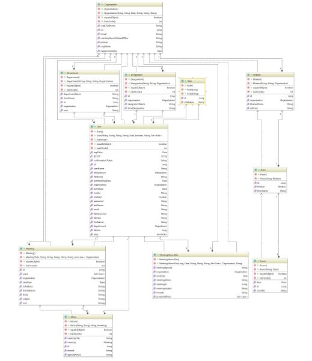
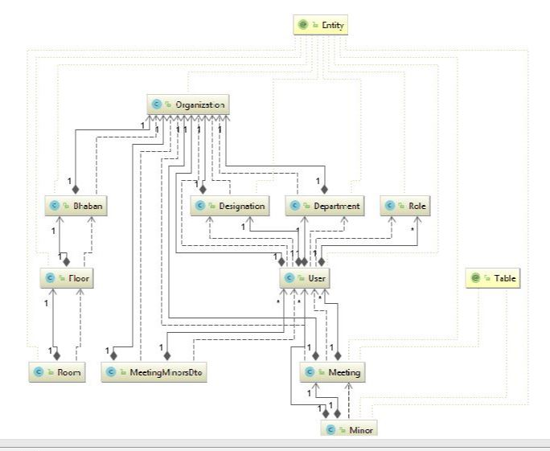
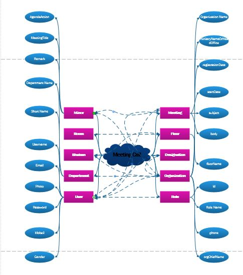
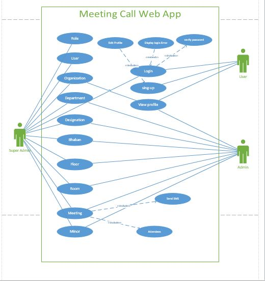

# MeetingCall
## Core, spring Boot, SQL, Template Engines

# Core
- DevTools

# Spring Boot
- Web
- Security
- Mail
- Standalone
- Opinionated

# SQL
- MySql  
   1. Reliability
   2. Performance
   3. Ease of deployment
   4. Open source

- JPA
  1. Developer Productivity
  2. Database Independent
  3. Type and Parameter Handling
  4. Avoid Unnecessary Queries
  5. Caching

# Template Engines
- Thymeleaf

# REST API

- Separation between the client and the server
- Visibility, reliability and scalability
- Independent of the type of platform or languages

# How to run this project?
- At first your MySql server run and then Spring Boot Application run.

# Images

*Entity Class*

*Entity diagram*

*Entity Relationship*

*Brainstorming Diagram*

*Use Case*

